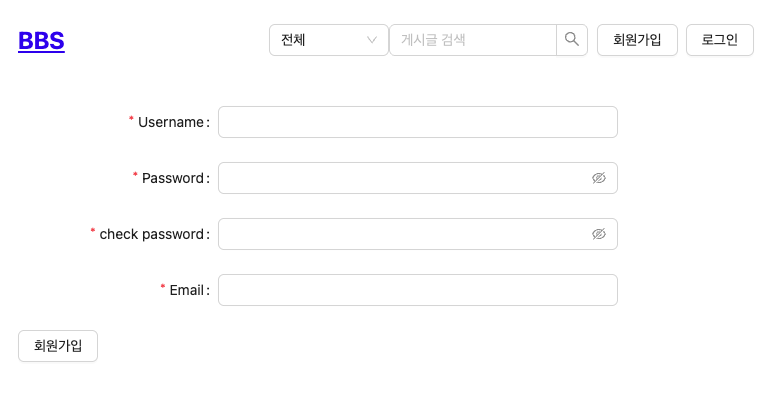
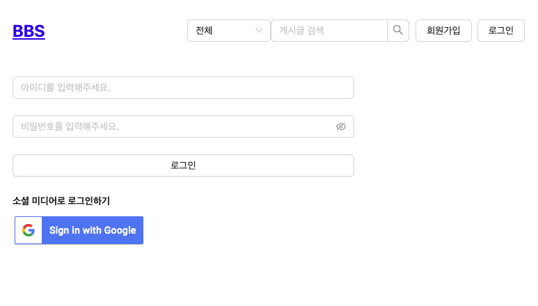

# BBS (Bulletin Board System)
## 개요
- **프로젝트 소개:** 글을 작성하고, 댓글과 대댓글을 달 수 있는 게시판 프로젝트
- **사용 기술**
	- React
	- Java
	- Spring Boot, Spring Security, Spring Data JPA, Spring Data Redis, QueryDSL
	- H2, Redis
	- Swagger
	- Github Actions, AWS S3, AWS EC2, AWS CodeDeploy

## 기능
### 회원
- 사용자는 게시글 및 댓글 서비스를 이용하기 위해 회원가입할 수 있다.
- 사용자는 아이디, 패스워드를 입력하여 로그인할 수 있다.
- 사용자는 구글 계정을 사용하여 로그인할 수 있다.

### 게시글
- 사용자는 게시글을 조회할 수 있다.
- 로그인한 사용자는 게시글을 작성/삭제/수정할 수 있다.

### 댓글
- 사용자는 게시글의 댓글/대댓글을 조회할 수 있다.
- 로그인한 사용자는 댓글/대댓글을 작성/삭제/수정할 수 있다.

## API

## 화면

