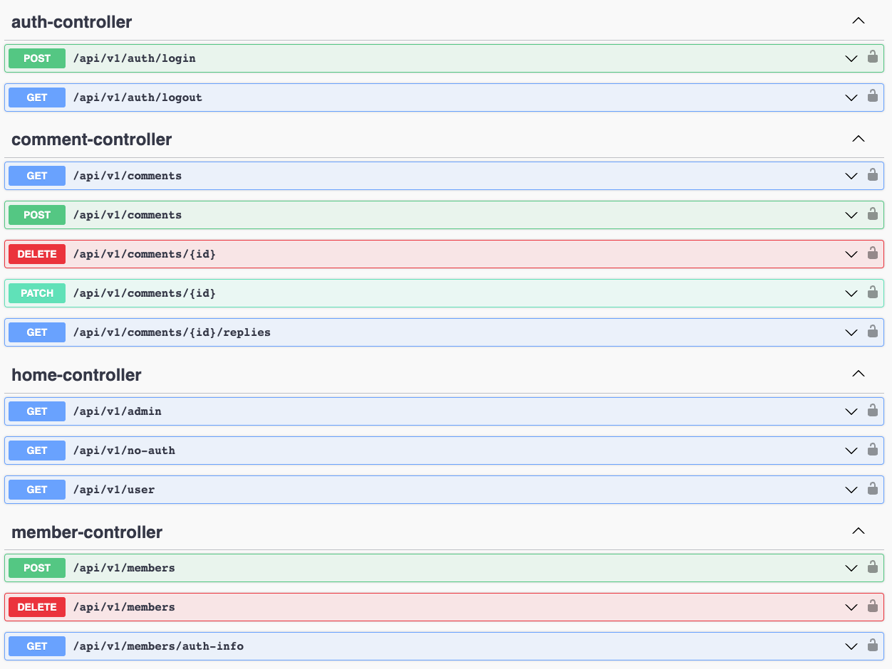
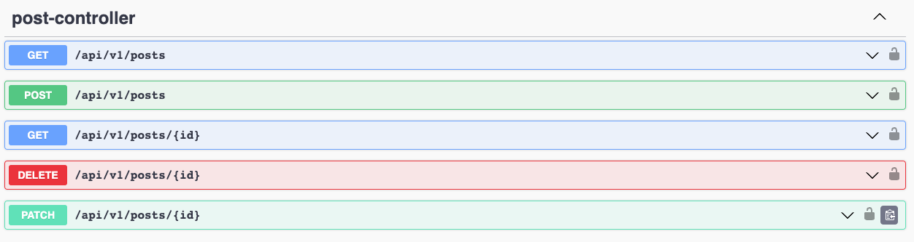
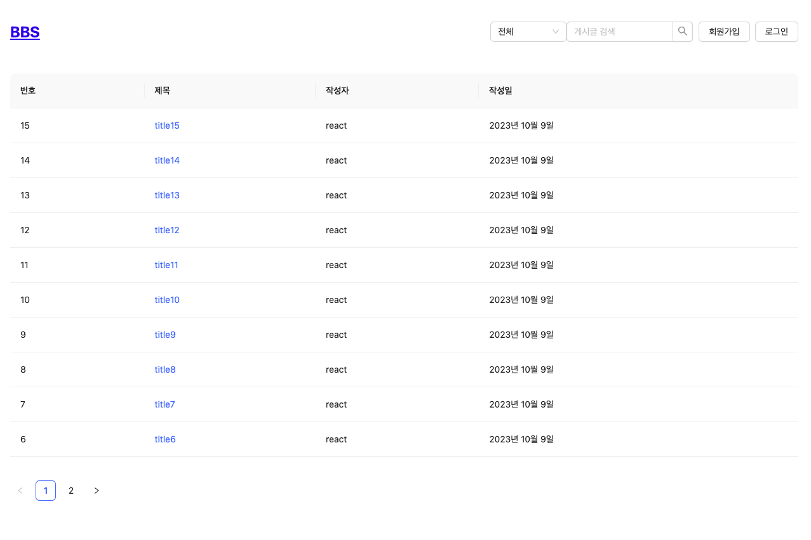
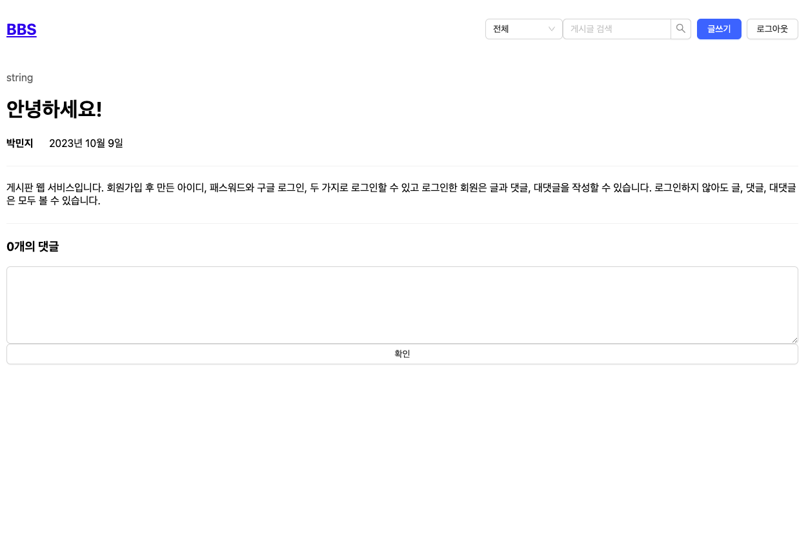
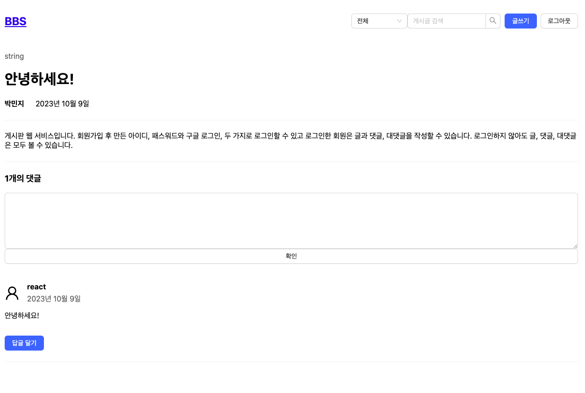

# BBS (Bulletin Board System)
### Description
- **프로젝트 소개:** 글을 작성하고, 댓글과 대댓글을 달 수 있는 게시판 프로젝트
- **개발 기간:** 2023.07.04 ~ 
- **사용 기술**
	- React
	- Java
	- Spring Boot, Spring Security, Spring Data JPA, Spring Data Redis, QueryDSL
	- H2, Redis
	- Swagger
	- Github Actions, AWS S3, AWS EC2, AWS CodeDeploy

## API

## 화면

